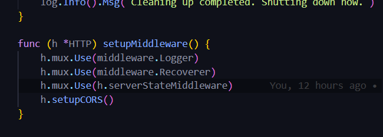
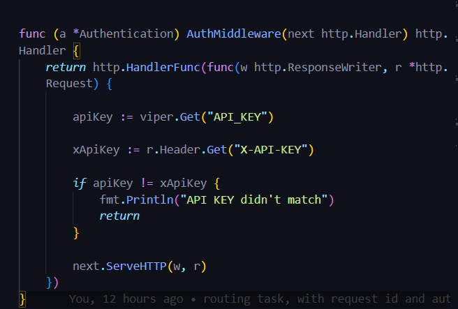
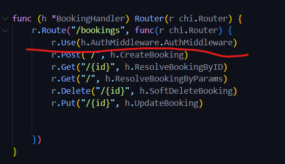
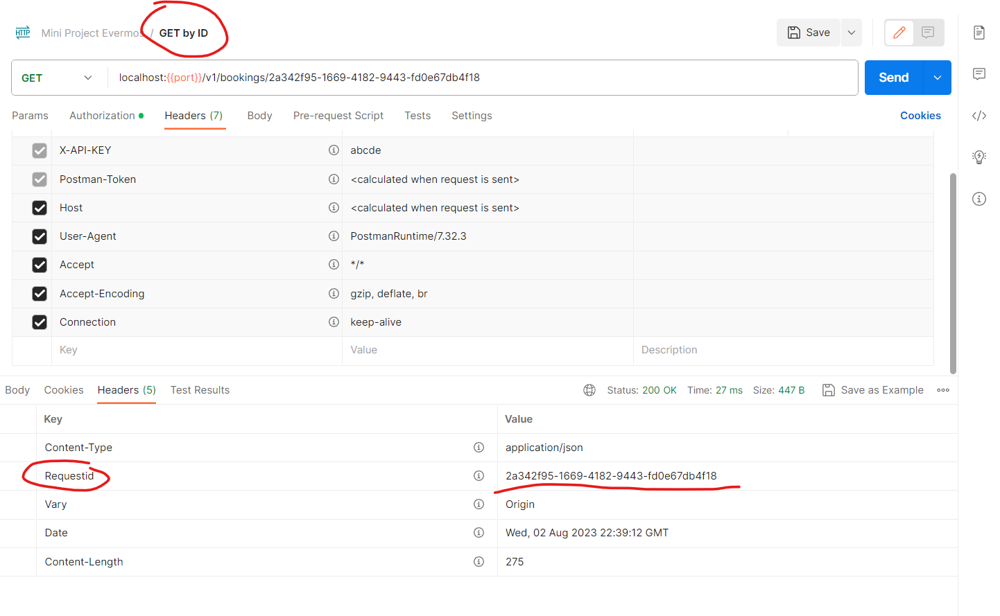

# Router Project

To run this project 
1. create new .env with .env example 
2. import database, you can find database on migrations\domain\bootcamp.sql 
```
mysql -u username -p new_database < path/to/bootcamp.sql
```

## Documentation
1. Adding middleware, you can find this in router/http.go

2. Add and use authentication middleware 


3. Adding Request Id using booking Id
)

