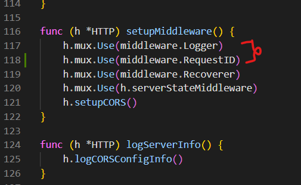
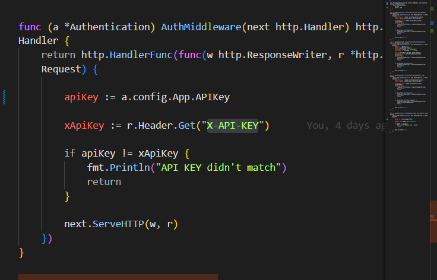
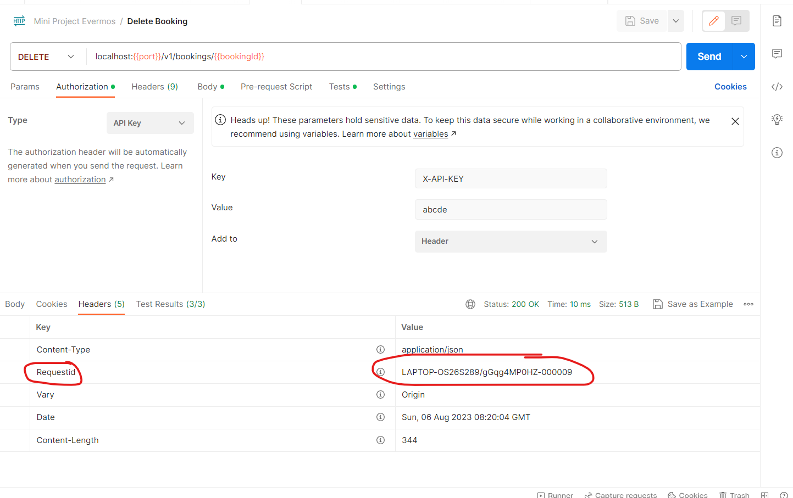

# Router Project

In this router project there is four main feature about booking photoshoot 

1. create booking
2. read booking with pagination 
3. update booking
4. soft delete booking

## Setup and Installation

1. clone this repository 
2. create new database to store bootcamp.sql
3. import database to mysql, you can find database on migrations\domain\bootcamp.sql
```
mysql -u username -p database_name < path/to/bootcamp.sql
```
4. copy .env.example file and rename to .env
5. fill the env with your credentials, database credentials and fill the api key on .env. ensure the api key should match to request header with key header "X-API-KEY"
```
APP.NAME=evm/boilerplate-go
APP.REVISION=commit-sha-here
APP.URL=http://localhost:8080
APP.API_KEY=<your api key>
```
6. run go generate command in root project to setup project
```
go generate ./...
```


## Documentation
1. Adding middleware, you can find this in router/http.go

2. Add and use authentication middleware 


3. Adding Request Id using booking Id


